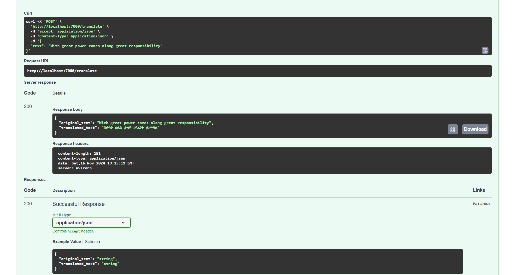

# Terguami: English-to-Amharic Translation API
<p>
  
  
  
  
  
</p>

This repository provides an English-to-Amharic translation API built with **FastAPI**. The core of the application is a custom transformer-based model trained from scratch using **PyTorch** on a carefully curated dataset. It offers a robust, scalable solution for translating English text into Amharic, with performance and extensibility in mind.

---

## ✨ Features

- 🚀 **High-Performance API**: Powered by FastAPI for asynchronous, fast, and efficient HTTP requests.
- 🧠 **Custom Transformer Model**: A transformer-based machine learning model developed from scratch with PyTorch.
- 📈 **Custom Dataset**: The model is trained on a carefully curated dataset to ensure accurate English-to-Amharic translations.
- 📜 **Extensible API**: Modular structure for easy integration with other systems or expansion with new features.
- 🔄 **OpenAPI Documentation**: Automatically generated and customizable API docs for developers.

---

## 🖼️ Demo Images

### API in Action


---

## Table of Contents

1. [Installation](#installation)
2. [Usage](#usage)
3. [Running with Docker](#running-with-docker)
4. [Endpoints](#endpoints)
5. [Model Details](#model-details)
6. [Future Improvements](#future-improvements)
7. [License](#license)

---

## ⚙️ Installation

### Prerequisites
- **Python 3.10+**
- **pip** package manager

### Clone the Repository
```bash
git clone https://github.com/amha-kindu/terguami.git
cd terguami
```

### Install Dependencies
```bash
pip install -r requirements.txt
```

**`requirements.txt`**
```
fastapi==0.115.5
uvicorn==0.32.2
pydantic==2.9.2
pydantic-settings==2.6.1
numpy==1.26.3
tokenizers==0.15.0
torch==2.1.2
```

---

## 🚀 Usage

### Running the Server
To start the server locally, run:
```bash
uvicorn main:app --host 0.0.0.0 --port 7000 --reload
```

Once running, the API will be accessible at `http://localhost:7000`.

---

## 🐳 Running with Docker

### Prerequisites
- **Docker** installed on your machine.

### Build the Docker Image
```bash
docker build -t terguami:v1 .
```

### Run the Docker Container
```bash
docker run -d -p 7000:7000 --name terguami-api terguami:v1
```

The API will now be accessible at `http://localhost:7000`.

---

### API Documentation
Visit `http://localhost:7000/docs` for interactive OpenAPI documentation, or `http://localhost:7000/redoc` for an alternative documentation view.

## 🌐 Endpoints

### Health Check
**`GET /health`**

Check the health status of the API.
- **Response**: 
  ```json
  { "status": "healthy" }
  ```

### Translation
**`POST /translate`**

Translate English text to Amharic.
- **Request Body**:
  ```json
  {
    "text": "Hello, how are you?"
  }
  ```
- **Response**:
  ```json
  {
    "original_text":"Hello, how are you?",
    "translated_text": "ሰላም፣ እንዴት ነህ/ነሽ?"
  }
  ```

---


## 🧠 Model Details

The translation model is a custom transformer-based architecture implemented in **PyTorch**, inspired by the "Attention Is All You Need" paper. It employs an encoder-decoder structure with multi-head self-attention in the encoder and cross-attention in the decoder to capture complex contextual relationships.

Key highlights include:

- **Custom Tokenizer**: Uses subword tokenization (Byte Pair Encoding) for robust handling of rare and compound words.
- **Preprocessing**: Applied Text preprocessing including lowercasing, abbreviation normalization, normalization of character level mismatch, punctuation & special character removal, and stopword removal for cleaner and consistent input data.
- **Dataset**: Trained on a curated English-Amharic parallel corpus, preprocessed to reduce noise and normalize tokens, with an 80-15-5 train-test-validation split.
- **Training**: Optimized using **AdamW** with a warm-up scheduler and cross-entropy loss with label smoothing to enhance generalization.
- **Inference**: Features beam search for improved accuracy and greedy decoding for faster results.

The model is further optimized for deployment with quantization to minimize latency and memory usage, ensuring efficiency in production environments.

---

## 🔨 Training Code

The training code for the custom transformer model is available in a separate repository by the same author. This code includes the full pipeline for training the model on a custom curated English-Amharic dataset, from data preprocessing to model optimization.

You can find the repository containing the training code here:
- [Training Code Repository](https://github.com/amha-kindu/machine-translation)

Feel free to explore the training process, contribute, or adapt the code for your own use!

---

## 🚧 Future Improvements

- 🚧 Add support for **bi-directional translation** (Amharic-to-English).
- ⚙️ Optimize inference speed using **ONNX Runtime** or **TorchScript**.
- 📊 Deploy on **AWS Lambda** for serverless scalability.
- 🔍 Implement advanced logging and monitoring with tools like **Prometheus**.

---

## 📜 License

This project is licensed under the MIT License. See the [LICENSE](LICENSE) file for details.

---

## 👥 Contributors

Developed and maintained by [Amha Kindu](https://github.com/amha-kindu).